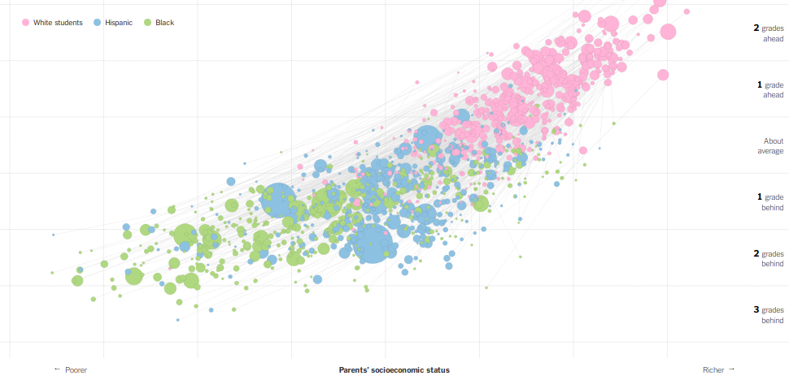
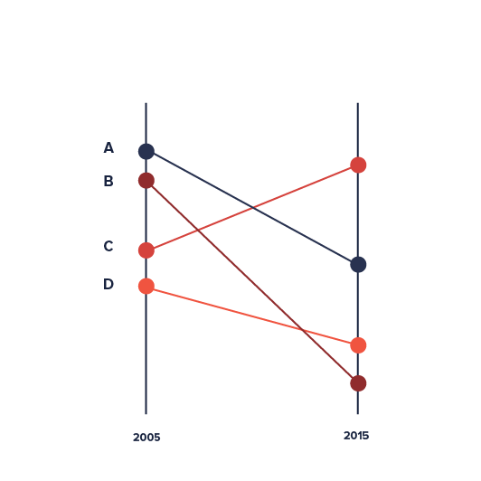

# Ефективні типи графіків

Ефективні види графіків, які рідко використовуються:   

- графік розсіяння

([джерело](http://www.nytimes.com/interactive/2016/04/29/upshot/money-race-and-success-how-your-school-district-compares.html))
- slope chart
 ([джерело](https://datavizproject.com/data-type/slope-chart/) )
- dot chart, [http://texty.org.ua/d/uz/](http://texty.org.ua/d/uz/) 
- small multiples, [http://texty.org.ua/action/file/download?file_guid=55933](http://texty.org.ua/action/file/download?file_guid=55933)
- гістограма [http://www.nytimes.com/interactive/2015/02/17/upshot/what-do-people-actually-order-at-chipotle.html](http://www.nytimes.com/interactive/2015/02/17/upshot/what-do-people-actually-order-at-chipotle.html)
- horyson charts  [http://www.nytimes.com/interactive/2014/upshot/mapping-the-spread-of-drought-across-the-us.html](http://www.nytimes.com/interactive/2014/upshot/mapping-the-spread-of-drought-across-the-us.html)

Стратегії - як зменшити складність візуалізацій:
- Похідні дані, а не початкові (не дохід і розхід, а баланс - різниця). Однак так, щоб показати усі дані
- Маніпуляція, додати інтерактив (зміна, вибір, навігація)
- Кути даних (розбивка, розділ, накладення), наприклад, small multiples
- зведення до простого (фільтрація, агрегація, вставка)

