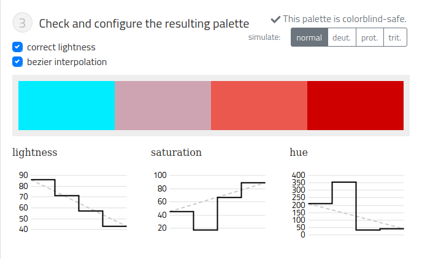

# Колір

Для просторових даних колір найчастіше є найкращим кодуванням для іще однієї змінної
- взаємодія між світлом яке бачим і кольором який сприймаєм - доволі складна
- для різних типів даних - різні кольорові схеми
- багато людей (особливо серед ЧОЛОВІКІВ) не сприймають відтінки кольору
- вибирайте кольори, за можливістю, не випадково
- оточення дуже сильно впливає на сприйняття: світлі кольори на темному тлі сприймаються не так, як темні кольори на світлому

### RGB
- хоча у нас є три типи сенсорів в оці (червоний зелений синій), ми думаємо про колір не в поняттях ЧЗС (RGB), а в поняттях LHS системи - освітленності (від білого до чорного), відтінку (червоний жовтий зелений синій ...) та насиченості (тьмяний - яскравий) - ще називають хрома - LHS система.

Ще є наприклад CMYK, для друкарської справи - скільки пігментів кожного типу змішати 
(Cyan(лазуровий), Magenta(пурпурний), Yellow, Key(black))
(Cyan can be thought of as minus-red, magenta as minus-green, and yellow as minus-blue)

Веб-дизайн знайомить вас з кольорами у 16-річній системі (hex — #ff007d , наприклад, рожевий, фуксія). 
RGB - адитивна система, для компів. Проблема — у переході між ними.

У якому форматі вам використати колір? — У якому вам зручно, бажано без зайвих ускладнень. Часто використовують hex, бо він має короткий запис (це моя причина — НР). Або rgb, бо він звичний.

Джерела кольору в екранах мають вузький спектр, в той час як очі звикли до широкого.
- компи рахують світло лінійно, а люди сприймають експоненційно (Лінійне збільшення яскравості кольорів сприймається нелінійно)
- ми більш чутливі до несильного світла, і значно менш чутливі до сильного світла
- ми сильніше сприймаємо зелений колір ніж червоний, а блакитний взагалі погано

З трьох компонент кольору — відтінок, насиченість та яскравість — яскравість найсильніший компонент. В результаті, коректні, однозначні зміни в яскравості є більш важливими, ніж зміни відтінку чи насиченості. Наприклад, кольорова гама від білого до кольору і до чорного читається краще, хоча насиченість на кінцях менше, ніж в центрі.

... 2,3,4,5

Тому для вибору та інтерполяції кольорів потрібно використовувати не математичний простір кольорів, а простір "сприйняття"  - адаптована система CIE L*c*h (освітленість-хрома-відтінок), створена з врахуванням того як люди сприймають кольори.  

Інструмент від Грегора Айка, [ChromaJS](https://gka.github.io/palettes/#/4|s|ffffe0,ffa500,ff1493,8b0000|ffffe0,ff005e,93003a|1|1)  

Зверніть увагу, є кнопка подивитись, як бачитимуть палітру люди з нетиповим сприйняттям кольорів (дальтонізмом тощо)

### Нюанси

Для різних даних потрібні різні палітри 
- sequential (кількісні) 
- diverging(кількісні з переходом через нуль) 
- qualitative (якісні, для різних категорій) 
Приклади — на [Colorbrewer](https://colorbrewer2.org/) Colorbrewer.

Райдужна палітра - погано для кількісних даних (наприклад, переходи в зоні яскравих 
лазурового або жовтого кольорів занадто різкий, непропорційно малий по щирині ніж в інших місцях палітри ). Тому краще використовувати послідовні палітри - перехід насиченості кольору наприклад, ось така палітра:

(Ні, diverging палітра тут була б доречніша)

Послідовні палітри найкраще робити з рівномірного переходу яскравості, з можливим, але необов'язковим невеликим змішенням у відтінку або насиченості кольору

Дуже гарна палітра Viridis

### Прив"язка кольору до значення

Дуже важливим є прив'язка кольору до значення. Використання культурного контексту,
вода, холод, демпартія в США - синя, вогонь, тепло, республіканці - червоні. 

Є цікавий спосіб - пошук в Гугл-зображеннях і усереднення кольорів. Тут рузельтати для англійської мови: http://uxblog.idvsolutions.com/2013/03/color-theory-squeezed-through-google.html
свіжий - зеленувато-жовтий,
природа - зелений

Ще один спосіб отримати "природні кольори": витягнути з фотографій простих пейзажів: захід сонця, море, ліси восени, тощо (Тафті)

Коли ви робите дизайн для багатьох рівнів інформації на картах, пам'ятайте що колір - дуже обмежений ресурс(мнемонічне правило). Використовуйте приглушені кольори у вузькому діапазоні, групуйте схожі дані по кольорам.

І не забувайте про головний принцип - **головні дані можна відрізнити від інших за допомогою кольору**.

Інструменти:
- ColorBrewer
- chroma.js (HCL picker, LAB, LCH, RGB, and HSV color picker - послідовні палітри, а для категорійних - Iwanthue)

