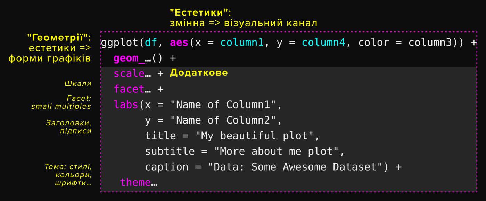

```{r}
library(tidyverse)
library(ggplot2)
library(lubridate)
library(scales)
```

Ggplot2 — частина добре знайомої нам бібліотеки Tidyverse.
Принцип роботи ggplot це "граматика даних", заснована на ідех візуального кодування. Документація з купою прикладів тут: https://ggplot2.tidyverse.org/, а ось cheetsheet-шпаргалка: https://github.com/rstudio/cheatsheets/blob/master/data-visualization-2.1.pdf
Структура ggplot-графіка така:


Спробуємо:
Як завжди, все починається з даних
```{r}
df <- read_csv("https://raw.githubusercontent.com/NadiaRom/djcourse/master/uku2020/day4-plots/google_trends_joined.csv") %>%
  mutate(date = as.Date(date))
```

Наші дані з гугл-трендів. Це пошук порід собачок, скачала ті, які згадала прямо з цього сайту: https://trends.google.com/trends/explore?date=2008-01-01%202020-04-26&geo=UA&q=%D1%86%D1%83%D1%86%D0%B5%D0%BD%D1%8F%D1%82%D0%B0

# Гра: задаємо питання і малює графіки, щоб знайти відповідь.
Наприклад, в якийсь момент Сіба-Іну стали популярні

```{r}
df_spj <- df %>%
  filter(breed %in% c("Shiba Inu", "Pug", "Jack Russell Terrier"))

ggplot(df_spj, aes(date, searched, color = breed)) +
  geom_step() +
  scale_y_continuous(name = "% search", limits = c(0, max(df$searched))) +
  theme_minimal()
  # geom_point()

ggsave("shiba_pug_jack.svg")

```


# Графіки — дуже крутий спосіб знаходити патерни в даних, шукати закономірності й відхилення.
https://texty.org.ua/d/2018/twitter/
Намалюємо такий же графік

```{r}
# Theme

my_theme <- theme(text = element_text(color = "#000000", family = "monospace"),
        plot.margin = margin(1, 1, 1, 1, unit = "cm"),
        panel.spacing = unit(2, "lines"),
        plot.title = element_text(size = 14, face = "bold",
                                  margin = margin(b = 1, unit = "cm")),
        plot.caption = element_text(color = "#525252", face = "italic", size = 5,
                                     margin = margin(t=0.5, unit = "cm")),
        axis.title = element_text(size = 6),
        axis.title.x = element_text(margin = margin(t=0.5, unit = "cm"), hjust=0),
        axis.title.y = element_text(margin = margin(r=0.5, unit = "cm")),
        strip.text = element_text(size = 10, face = "bold", hjust = 0,
                                  margin = margin(b = 0.2, unit = "cm")),
        axis.text = element_text(size = 5, color = "#525252"),
        panel.grid.minor = element_blank(),
        panel.grid.major = element_line(colour = "#bdbdbd", size = 0.1)
        )
```

```{r}
tw_v <- read_csv("vakarchuk_twitter.csv") %>%
  mutate(created_at = ymd_hms(created_at),
         who = "Вакарчук") %>%
  sample_n(75000)

tw_k <- read_csv("kamaliia_twitter.csv") %>%
  mutate(created_at = ymd_hms(created_at),
         who = "Камалія") %>%
  sample_n(75000)

tw <- rbind(tw_v, tw_k)
remove(tw_k, tw_v) 

ggplot(tw, aes(order, created_at)) +
  geom_point(alpha = 0.03, color = "#2E54E8", size = 0.1) +
  scale_x_continuous(labels = comma) +
  # Розібралась: scales = "free" працює з facet_wrap, але не з facet_grid
  facet_wrap(vars(who), scales = "free") +
  labs(y = "Рік реєстріції падписників у Твіттер",
       x = "Порядковий номер підписників",
       title = "Хто купив твіттер-ботів?",
       caption = "Дані: Twitter") +
  theme_minimal() + my_theme    # див. вище, тепер цю тему можна всюди додавати
  

# Не зберігайте 100500 точок у векторних форматах (svg), бо це буде дуже великий файл, з яким неможливо працювати
ggsave("plot_twitter_both.png", width = 16, height = 10, units = "cm")


```

## Неможливо показати все-все
```{r}
ggplot(df, aes(date, searched, color = breed)) +
  geom_line(show.legend = FALSE) +
  scale_y_continuous(name = "% search", limits = c(0, max(df$searched))) +
  theme_minimal()
```

Про такі графіки писав Альберто Каїро, типовий приклад перевантаженого графіка
Small multiples пішать на допомогу

```{r}

ggplot(df, aes(date, searched)) +
  geom_area(fill = "#01665e") +
  scale_y_continuous(name = "% search", limits = c(0, max(df$searched))) +
  facet_wrap(vars(breed)) +
  labs(title = "Клікабельні песики",
       subtitle = "Динаміка пошукових запитів за породами собак,\n% від максимального",
       caption = "Дані: Google Trends",
       x = "дата",
       y = "") +
  theme_minimal() +
  theme(text = element_text(family = "Source Sans Pro"),
        plot.margin = margin(2, 2, 2, 2, "cm"),
        axis.title.y = element_blank())
```

Інтерактив у плотлі — можна додати тултіп — підказку при наведенні
```{r}
install.packages("plotly")
library(plotly)

allbreeds <- ggplot(df, aes(date, searched, color=breed)) +
  geom_line(alpha = 0.4, size = 0.3, show.legend = FALSE) +
  scale_y_continuous(name = "% search", limits = c(0, max(df$searched))) +
  scale_x_date(breaks = str_c(2008:2020, "-01-01") %>% as.Date,
               label = year) +
  theme_minimal()

p <- ggplotly(allbreeds, tooltip = c("breed"))

p
```

# Хочеш зробити щось добре — зроби це сам[a]:)
Не завжди, але з інтерактивом правило працює.    
Часто бібліотеки для інтерактивних графіків не дають бажаного результату. На певному етапі стає легше **не** "чаклувати" на бібліотекою, а зробити все самим за допомогою мови JavaScript (стандартна мова всіх веб-браузерів).
Код брала тут https://stackoverflow.com/questions/43784425/change-the-overlaying-order-of-lines-in-ggplot і тут https://gist.github.com/rensa/1d988451ae15882c889f49cf20b99a64

1. Перенесемо наше векторне зображення в html.
Все супер, але ми не знаємо, яка лінія відповідає за яку собачку. Треба десь її записати, в фтрибутах тегу, наприклад. (див у interactive.html)

## 1. Мусимо знати порядок, в якому ggplot малював наші дані. R має фактори — порядкові змінні, в яких крім значення є порядок (так, у нас номінальна=категорійна змінна, але для того, щоб знати яка лінія яку породу представляє ми зробимо трюк з порядковою, на графіку ж не видно цього)
```{r}
df$breed <- df$breed %>%
  factor(levels = df$breed[1:25])

allbreeds <- ggplot(df, aes(date, searched, group = breed)) +
  geom_line(color = "#525252", alpha = 0.4, size = 0.3) +
  scale_y_continuous(name = "% search", limits = c(0, max(df$searched))) +
  scale_x_date(breaks = str_c(2008:2020, "-01-01") %>% as.Date,
               label = year) +
  theme_minimal()

ggsave("breeds_grey.svg", plot=allbreeds, device="svg", width = 16, height = 10, units = "cm")

levels(df$breed[1:25])
# скопіюємо ці рівні у наш веб-скрипт

```


# Лайфхак, щоб з'єднати гугл-тренди
Лишила тому, що робила це аби зробити гарні дані для ggplot, можна розібрати як завання з зірочкою
```{r}
read_dog <- function(filename) {
  read.csv(filename, skip=2, as.is = T) %>%
    mutate_all(~ str_replace(., "<1", "0")) %>%
    pivot_longer(cols = -c(Month),
                 names_to = "breed",
                 values_to = "searched") %>%
    mutate(breed = str_remove_all(breed, "...Ukraine.") %>%
             str_replace_all("\\.", " "),
           searched = as.numeric(searched),
           Month = str_c(Month, "-01") %>%
             as.Date()
           ) %>%
    rename(date = Month)
}


find_proportion <- function(df1, df2, intersecting) {
  searched1 <- df1 %>%
    filter(breed == intersecting) %>%
    summarise(max(searched)) %>%
    .[[1,1]]
  
  searched2 <- df2 %>%
    filter(breed == intersecting) %>%
    summarise(max(searched)) %>%
    .[[1,1]]
  
  searched2 / searched1
}

files <- str_c("data/", list.files("data"))

df <- read_dog(files[1])

for (i in 2:length(files)) {
  df2 <- read_dog(files[i])
  intersecting <- df %>%
    filter(breed %in% df2$breed) %>%
    select(breed) %>%
    .[[1, "breed"]]
  
  coef <- find_proportion(df, df2, intersecting)
  
  df <- df %>%
    mutate(searched = round(searched * coef)) %>%
    filter(breed != intersecting) %>%
    rbind(df2)
}
df$searched %>% max()

df <- df %>%
  arrange(date) %>%
  mutate(searched = searched / max(searched) * 100)

# df %>% write.csv("google_trends_joined.csv", row.names = FALSE)

```


